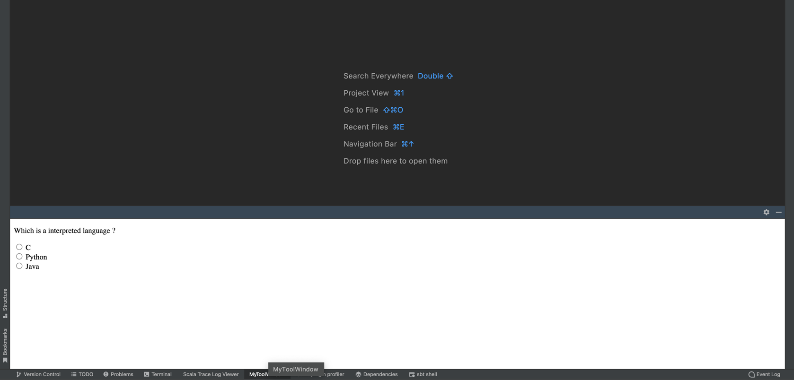
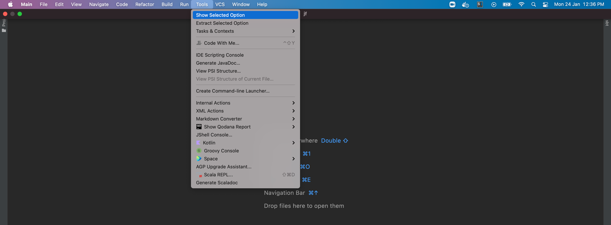
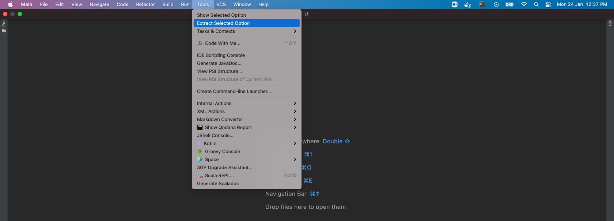

This is a simplified **intellij plugin** example   
to reproduce **javascript execution using JCEF**.

---

Build file used for this example is **sbt**.   
So, kindly install **scala plugin** to import this project in intellij.

---

Once plugin project is imported in IDE,
launch jcefUserSelection application.


After launching application, you should see a new instance of intellij.   
Now, you can either create a new project, or open any existing project.   

Once the project is created/opened, you should see a tool-window option at the bottom.   
Click on it to see sample html.



---

Now, we will try to inject javascript using JCEF apis   
with the help of two example actions.


1. ShowUserSelection


Check the console output of jcefUserSelection application.   
You should see console output printed from ShowUserSelection.java file.

```
[AWT-EventQueue-0-1643009600245] : executing java script from action thread
[AWT-AppKit-1643009600279] : string is >:c<
```

2. ExtractUserSelection
   

Check the console output of jcefUserSelection application.   
You should see console output printed from ExtractUserSelection.java file.

```
[AWT-EventQueue-0-1643009638974] :  executing java script from action thread
[AWT-EventQueue-0-1643009638981] : now wait for element in queue
```

---

Issue :-

javascript injection is not working, if thread that is injecting javascript    
wait for the response from **JBCefJSQuery handler** using **SynchronousQueue**.